# ZeroDesk

ZeroDesk 是一个极简、直观的桌面端 Multi-Agent 任务编排工作台。

它用可视化方式拆解任务、调度模型、组织 Agent、沉淀知识和追踪执行过程，适合研发、分析、运营、写作、研究等需要把复杂任务拆成可控步骤的场景。

ZeroDesk 的目标不是堆出一群“虚拟员工”，而是让每一次 LLM 调用都有清晰的上下文边界、模型选择、质量门禁和人工接管入口。

## 核心理念

**用最少的步骤、最合适的模型、最严格的质量门禁，完成一个任务。**

ZeroDesk 不鼓励“为了分工而分工”。Agent 数量不是越多越好，真正有价值的是：

- 上下文隔离：每个步骤只关注相关信息，避免超长上下文带来的质量退化
- 生成与审核分离：关键产出可以交给独立验收步骤检查
- 模型路由：不同任务步骤匹配不同成本、速度和能力等级的模型
- 全程可控：多步执行可以在任意节点暂停、检查、纠偏或恢复

界面风格追求轻量、平静、可长时间使用，而不是复杂企业后台式的厚重感。

## 功能特性

### 通用 AI 对话

- 提供独立的「对话」一级入口，用于日常轻量问答、写作、代码解释和临时思路整理
- 对话与任务执行流分离，不需要创建任务即可直接选择模型并开始聊天
- 支持会话列表、历史消息保存、模型切换、温度和最大输出 Tokens 等基础设置
- 适合即时交流；当工作需要多步骤规划、Agent 分工和质量门禁时，再进入任务中心

### 极简任务发起与可编辑计划

- 输入任务目标、成本档位和约束条件后，由 AI 生成执行计划
- 计划分为执行步骤和 Agent 团队两个维度，用户确认后才开始执行
- 支持编辑步骤、调整顺序、重新分配 Agent、修改 Prompt 和模型
- AI 会优先复用已有 Agent，只在确实需要时建议新建
- 新建 Agent 可在任务完成后沉淀到 Agent 库，成为可复用资产

### Agent 与团队管理

- Agent 是带有系统提示词、模型偏好、工具权限和能力描述的 LLM 调用配置
- 支持手动创建、复制、归档和保存模板
- 支持将多个 Agent 组合成团队模板，方便复用成熟工作流
- 支持团队共享 Skills，并为不同 Agent 配置私有能力

### 智能模型路由

- 管理多组 Provider、Base URL、API Key 和模型池
- 可为不同 Agent 推荐或手动选择适合的模型
- 内置常见模型参考价格，支持输入、输出、缓存创建、缓存命中四类单价
- 当供应商未返回价格时，可使用系统默认价格作为成本估算依据
- 支持模型健康检查、Fallback 链、重试策略和预算护栏
- 当首选模型不可用时，可自动切换备用模型，减少工作流中断

### 实时执行控制台

- 实时展示 Agent 消息流、步骤状态、Token 消耗、耗时和执行进度
- 根据不同 Agent 使用的模型和 token 用量估算任务费用
- 任务目标支持单行摘要与展开查看，避免长目标挤占执行区域
- 支持暂停、恢复、重试、终止和从失败节点续跑
- 用户可以插入纠偏指令，或手动修改某步输出后继续执行
- 执行日志、中间产物和最终产物都会保留，方便复盘

### 知识库与上下文管理

- 管理公共知识、文档目录、版本历史和可注入上下文
- 基于 SQLite FTS5 做本地全文检索
- 支持按需把相关知识片段注入任务上下文，避免无效 Token 消耗
- 文档修改保留时间线，可回退到历史版本

### PromptOps 与模板工坊

- 管理 Agent Prompt 的版本、备注、回滚和复用
- 支持 Prompt 模板和任务流程模板
- 记录模型选择、路由和降级原因，降低黑盒感

### 成本、质量与审计

- 数据看板展示任务数量、成功率、Token 消耗、费用和执行趋势
- 费用展示支持美元和人民币切换，人民币金额按设置中的 USD/CNY 汇率换算
- 支持节点级验收、结构化输出约束和人工检查点
- 记录关键配置变更和执行过程，方便审计与排障

## 功能展示

### 通用 AI 对话

对话入口用于日常轻量 AI 聊天，不强制进入任务规划流程。用户可以创建多个会话、选择模型、调整基础参数并保存聊天历史。

### 任务发起与任务池

任务中心用于创建任务、选择快速模板、查看进行中/已完成/失败/草稿任务，并作为多 Agent 工作流的入口。

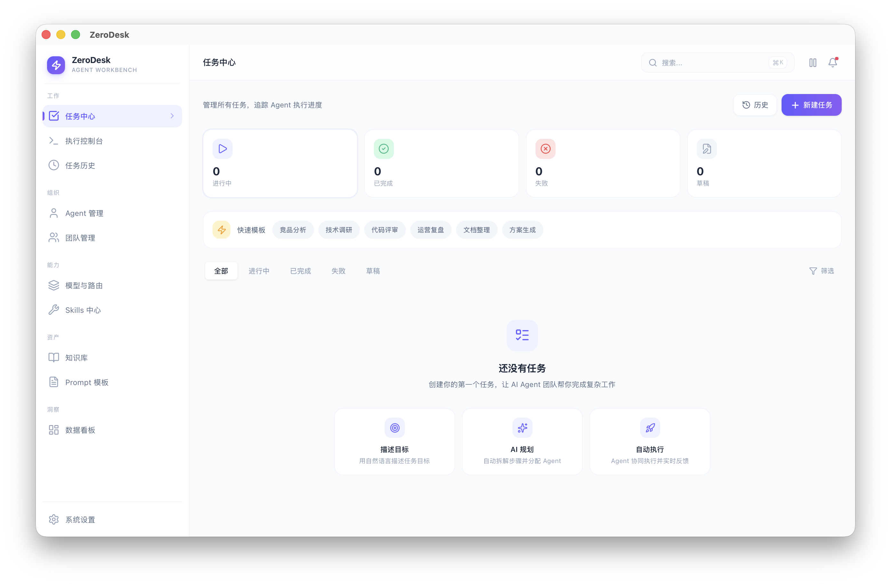

### 执行控制台与人工接管

执行控制台用于观察任务执行过程、查看 Agent 对话和中间产物，并在需要时暂停、恢复、重试或插入纠偏指令。

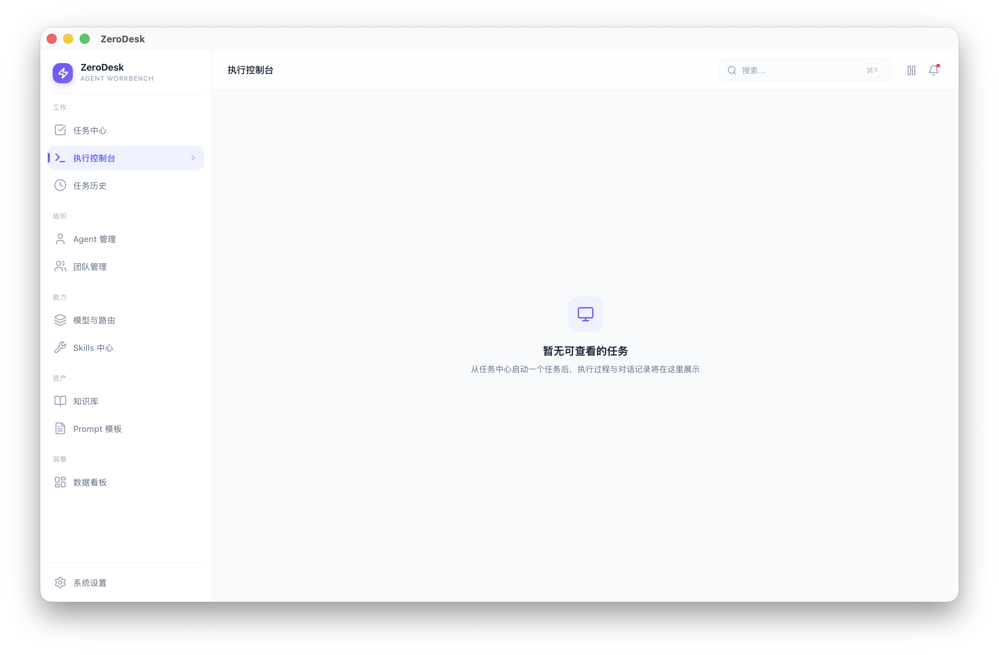

### 历史复盘

任务历史页面用于查看历史执行记录、统计成功率和总消耗，后续可扩展为故障复盘与一键重执行入口。

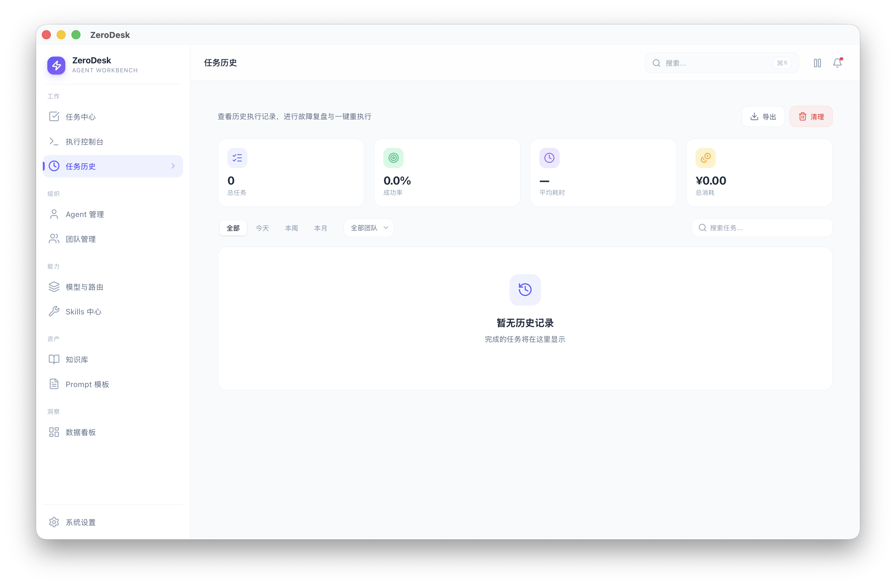

### Agent 与团队资产

Agent 管理用于沉淀可复用的角色、Prompt、模型偏好和工具权限。团队管理用于将多个 Agent 组织成协作团队，复用成熟的任务执行结构。

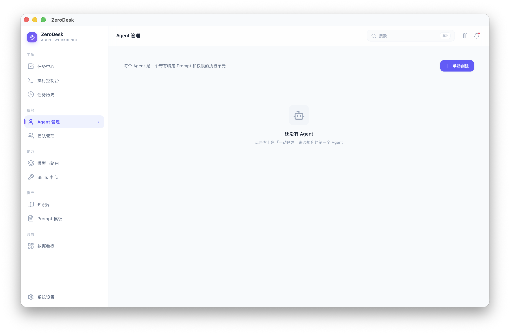

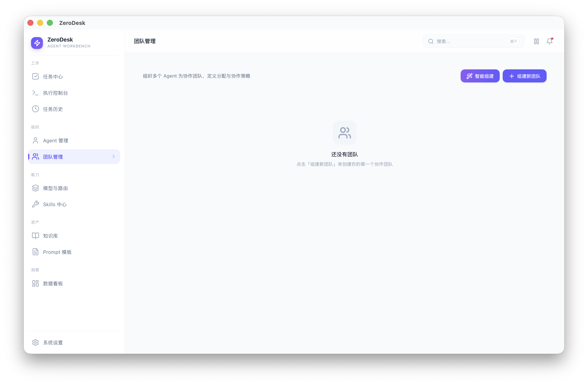

### 模型与路由

模型与路由页面用于配置模型供应商、系统内置模型、Agent 模型池、Fallback 链和容错策略，让不同步骤可以选择合适的模型。

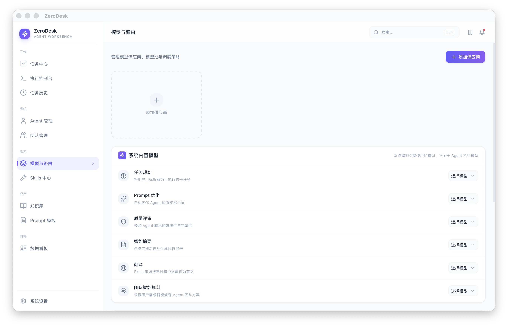

### Skills 能力扩展

Skills 中心用于管理本地与在线 Skills，并按全局、团队或 Agent 私有作用域分配外部能力。

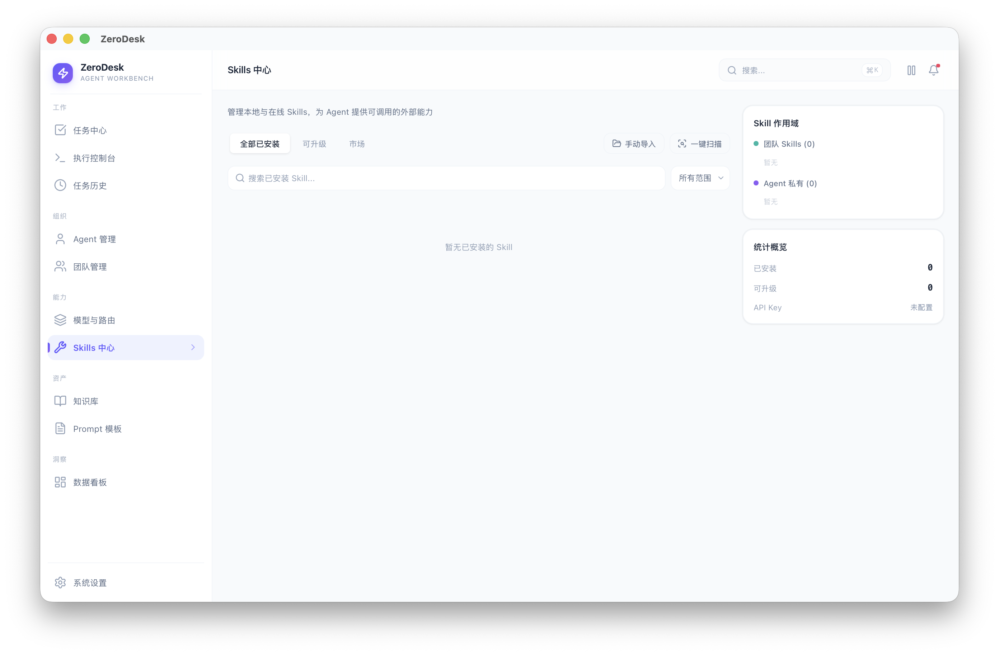

### 知识库与 PromptOps

知识库用于沉淀公共知识、文档和可注入上下文。Prompt/模板中心用于管理可复用的 Prompt 资产、版本和任务模板。

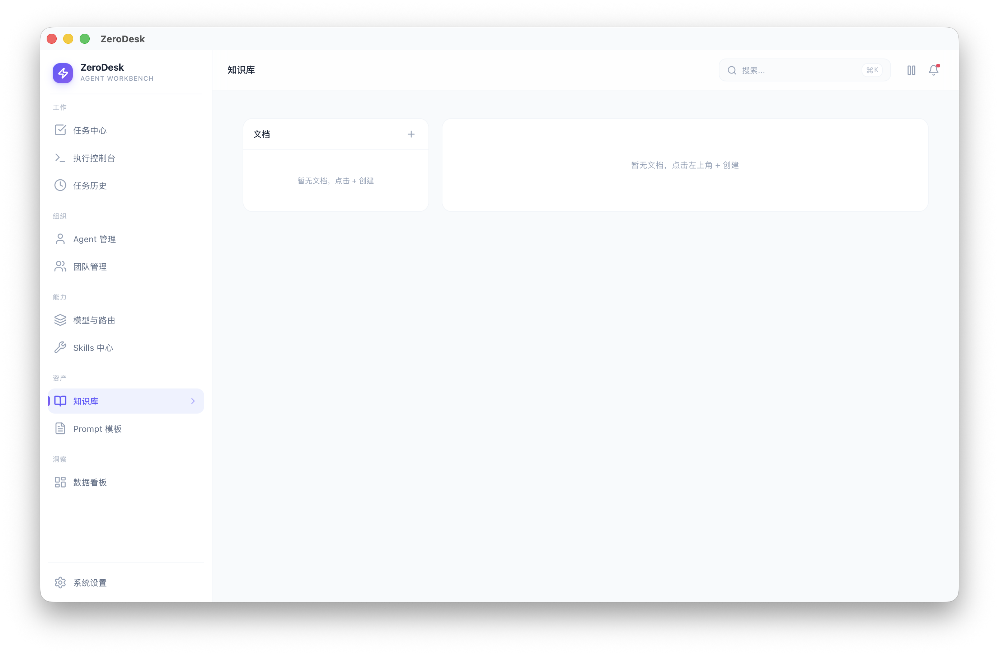

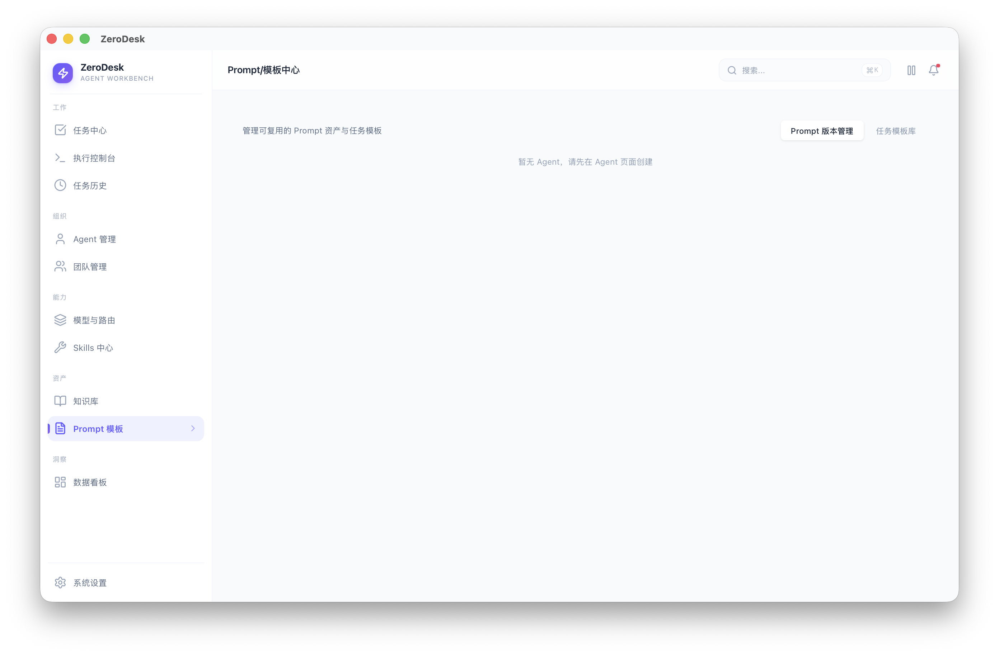

### 数据看板与系统设置

数据看板用于观察任务数量、成功率、Token 消耗、成本分布和 Agent 使用情况。系统设置用于管理本地偏好、数据存储、通知、Skills 市场配置、模型价格参考、费用币种和关于信息。

侧边栏支持收缩为低干扰图标栏，适合在执行控制台等长时间观察页面中释放更多横向空间。

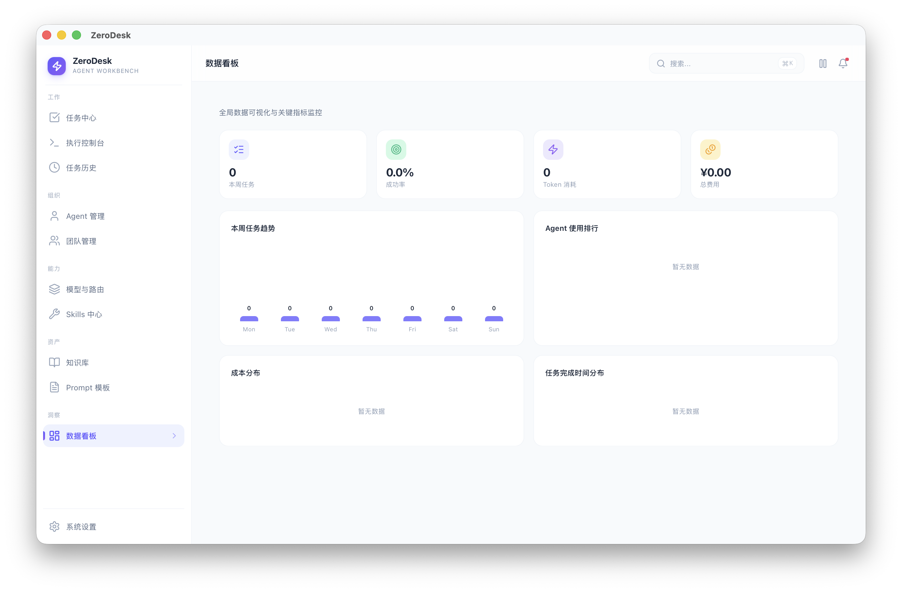

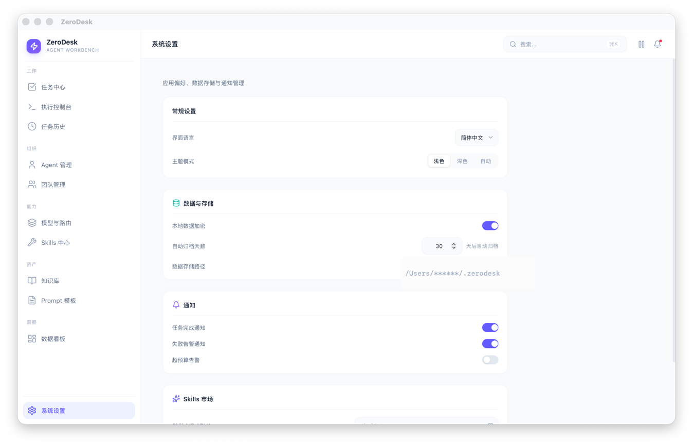

## 技术栈

- 前端：React 19、TypeScript、Vite 7、TailwindCSS 4、React Router 7
- 状态管理：Zustand、TanStack Query
- 后端：Rust、Tauri 2、Tokio、SQLx
- 数据库：SQLite，启用 WAL 和 FTS5
- 富文本与渲染：Tiptap、react-markdown、remark-gfm、Mermaid
- 图标：Lucide React
- 通知：Sonner
- 包管理：pnpm

## 安装与运行

安装依赖：

```bash
pnpm install
```

启动完整 Tauri 开发环境：

```bash
pnpm tauri dev
```

常用命令：

```bash
pnpm dev          # 启动 Vite dev server，默认端口 1520
pnpm build        # TypeScript 检查 + Vite 构建
pnpm tauri dev    # 启动完整 Tauri 开发环境
pnpm tauri build  # 构建桌面端安装包
```

## 发布包

推送版本号 tag 后，GitHub Actions 会自动构建发布包，也可以在 Actions 页面手动触发 Release 流水线。

```bash
git tag -a 0.0.2 -m "发布 0.0.2"
git push github 0.0.2
```

发布 GitHub Release 时，Release Notes 需要包含面向用户的详细变更与安装包使用注意事项。详细变更建议按新增功能、修复问题、体验优化、兼容性变化和已知问题组织；安装说明需要覆盖不同平台包的适用场景、macOS 未签名或未公证时的首次打开提示、升级安装、数据备份、回退方式和已知限制。

流水线产物命名规则：

```text
ZeroDesk-{version}-{yyyyMMdd}-macos-arm64.dmg
ZeroDesk-{version}-{yyyyMMdd}-macos-x64.dmg
ZeroDesk-{version}-{yyyyMMdd}-windows-x64-setup.exe
```

平台说明：

- `macos-arm64.dmg`：适用于 Apple Silicon Mac，例如 M1、M2、M3、M4
- `macos-x64.dmg`：适用于 Intel Mac
- `windows-x64-setup.exe`：适用于 Windows x64

当前发布包尚未做 Apple Developer ID 签名与公证。macOS 首次运行时可能需要在系统设置中手动允许打开。

## 项目结构

```text
src/                          # 前端 React
├── app/                      # 页面组件
│   ├── chat/                 # 通用 AI 对话
│   ├── tasks/                # 任务中心
│   ├── console/              # 执行控制台
│   ├── agents/               # Agent 管理
│   ├── teams/                # 团队管理
│   ├── models/               # 模型与路由
│   ├── skills/               # Skills 中心
│   ├── knowledge/            # 知识库
│   ├── prompts/              # Prompt 模板
│   ├── dashboard/            # 数据看板
│   └── settings/             # 系统设置
├── components/
│   ├── layout/               # AppLayout, Sidebar, Topbar
│   ├── ui/                   # 通用 UI 组件
│   └── search/               # CommandPalette 全局搜索
├── hooks/                    # TanStack Query hooks
├── stores/                   # Zustand stores
├── lib/                      # Tauri invoke 封装与工具函数
└── types/                    # TypeScript 类型

src-tauri/                    # Rust + Tauri 后端
├── src/
│   ├── commands/             # 按领域拆分的 Tauri commands
│   ├── db/                   # SQLite 初始化和迁移
│   ├── engine.rs             # 任务执行引擎
│   ├── context_builder.rs    # LLM 上下文组装与 token 估算
│   ├── lib.rs                # 应用入口和 command 注册
│   └── models/               # Rust 数据模型
└── tauri.conf.json
```

## 实现说明

- UI 文案目前以中文硬编码为主，暂未引入 i18n
- 本地数据目录默认位于 `~/.zerodesk/`
- SQLite 使用 WAL 模式，全文检索依赖 FTS5
- 每次启动会自动重建 FTS 索引，保证搜索数据一致
- Tauri WebView 原生右键菜单已禁用，应用内使用自定义右键菜单
- 前端路径别名 `@` 指向 `./src`
- Tauri remote dev 的 HMR WebSocket 固定使用 1421 端口
- `libsqlite3-sys` 使用 bundled 模式编译，确保 FTS5 可用

## 文档

- [功能需求清单](docs/功能列表.md)
- [贡献指南](CONTRIBUTING.md)

## 贡献

欢迎提交 issue、功能建议、文档改进和 Pull Request。开始之前请阅读 [CONTRIBUTING.md](CONTRIBUTING.md)。

如果提交中包含 AI 协作生成的代码、文档或其他内容，请在提交正文末尾添加对应 AI 协作者信息，例如：

```text
Co-Authored-By: Codex <noreply@openai.com>
```

如果使用的是其他 AI 工具或模型，请替换为对应名称和可用邮箱。

## 许可证

ZeroDesk 使用 [Apache License 2.0](LICENSE) 发布。

你可以自由地个人使用、商用、修改和分发。若你基于 ZeroDesk 发布产品或服务，请保留许可证与 [NOTICE](NOTICE) 文件，并在合理位置说明你的项目基于 ZeroDesk。
